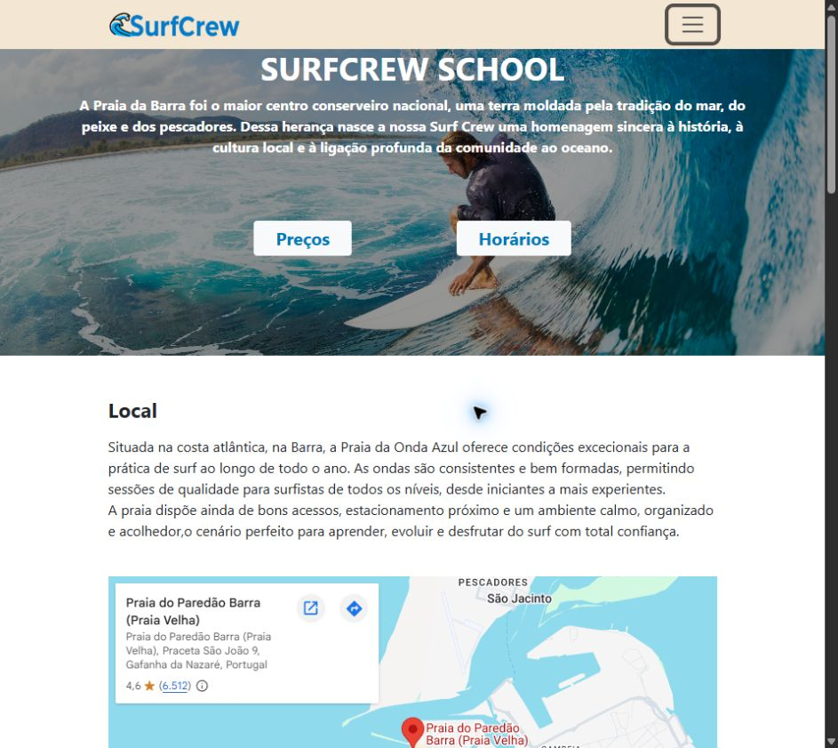
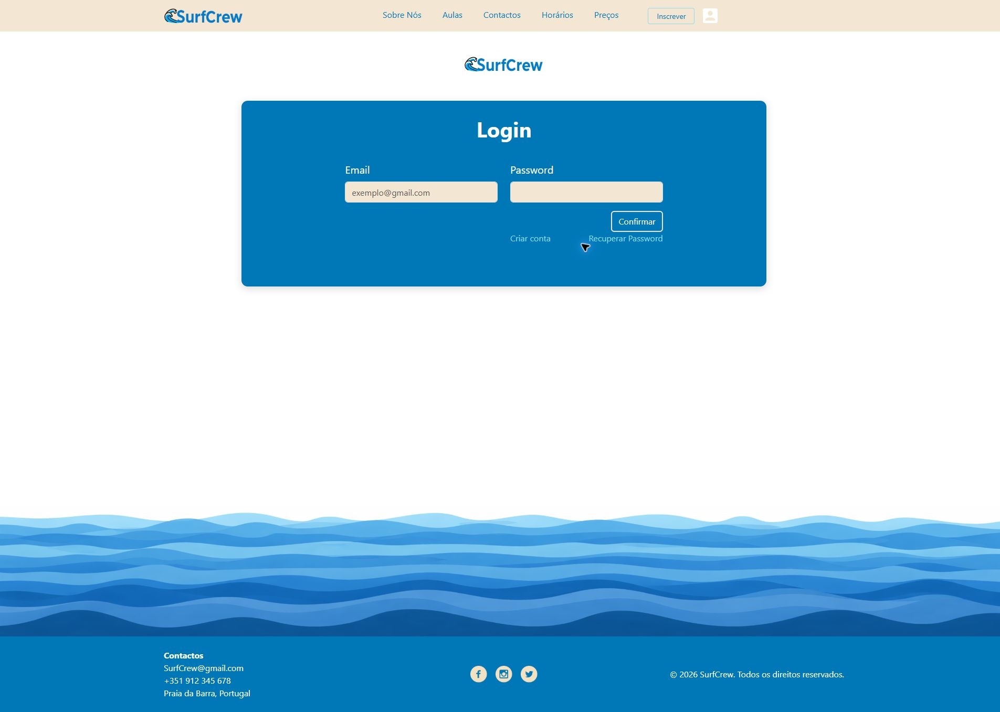
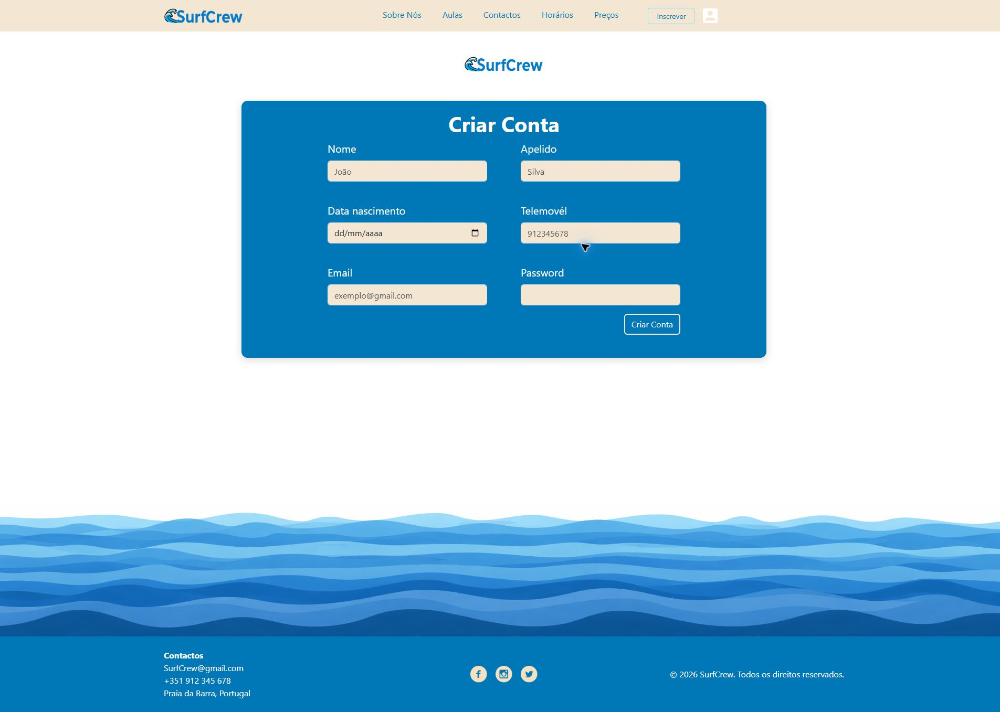

# SurfCrew School

Aplicação web full-stack para a gestão de uma escola de surf, desenvolvida com PHP e MySQL. O sistema reúne autenticação, inscrições, gestão de aulas, área do utilizador e painel administrativo.

## Screenshots

### Página inicial



### Login



### Criação de conta



## Funcionalidades

### Área pública e autenticação

- Registo e autenticação de utilizadores
- Recuperação de senha
- Consulta de horários e preços
- Inscrição em aulas

### Área do utilizador

- Consulta e edição do perfil
- Visualização das aulas inscritas
- Consulta do mapa e informações das aulas

### Painel administrativo

- Criação, edição, listagem e remoção de aulas
- Criação, edição, listagem e remoção de utilizadores
- Gestão de perfis e grupos de utilizadores

## Tecnologias

- PHP
- MySQL
- PDO para acesso à base de dados
- HTML5
- CSS3

## Estrutura do projeto

```text
surfcrew/
├── admin/              # Gestão de aulas e utilizadores
├── assets/             # CSS e imagens
├── auth/               # Registo, login, logout e recuperação de senha
├── pages/              # Páginas e conteúdos da aplicação
├── src/
│   ├── database/sql/   # Esquema da base de dados e documentação
│   └── includes/       # Ligação à base de dados e componentes partilhados
├── user/               # Área e perfil do utilizador
├── acessar.php
├── horariopreco.php
├── index.php
└── inscrever.php
```

## Como executar localmente

### Requisitos

- PHP 8.0 ou superior recomendado
- MySQL ou MariaDB
- Servidor web como Apache (XAMPP, WAMP ou equivalente)

### Instalação

1. Clone o repositório:

   ```bash
   git clone https://github.com/jay-braga/surfcrew-school.git
   ```

2. Coloque a pasta `surfcrew` no diretório público do seu servidor web.

3. Crie uma base de dados chamada `surfcrew`.

4. Importe o arquivo:

   ```text
   surfcrew/src/database/sql/tabela.sql
   ```

5. Configure a ligação à base de dados em:

   ```text
   surfcrew/src/includes/db.php
   ```

   Substitua `SEU_USER` e `SUA_PASSWORD` pelas credenciais do seu ambiente local.

6. Inicie o Apache e o MySQL e abra o projeto no navegador, por exemplo:

   ```text
   http://localhost/surfcrew/
   ```

## Segurança

- O acesso à base de dados utiliza PDO.
- Não publique senhas ou credenciais reais no repositório.
- Em produção, armazene configurações sensíveis em variáveis de ambiente.
- Valide permissões de administrador no servidor, não apenas na interface.

## Próximos passos

- Adicionar testes automatizados
- Migrar as credenciais para variáveis de ambiente
- Adicionar screenshots e uma demonstração online
- Melhorar a validação de formulários e mensagens de erro
- Documentar os diferentes níveis de acesso

## Autor

Desenvolvido por [jay-braga](https://github.com/jay-braga).

## Licença

Este projeto está disponível sob a licença MIT. Consulte o arquivo `LICENSE`.
